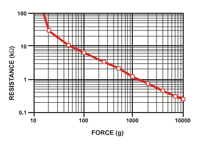
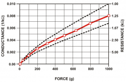
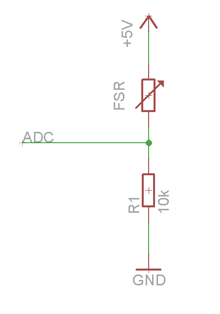

# Force Sensing Resistor  - FSR402

Basicamente, os FSR *(Fig. 1)* são dispositivos que produzem uma queda na resistência elétrica conforme mais força física (ou pressão) é aplicada sobre ele *(Fig. 2)*. A quantidade de eletricidade que é possível fluir no circuito depende da pressão exercida no sensor, já que, quanto maior a pressão, mais material condutivo entrará em contato com os fios e aumentar a saída elétrica de forma previsível - o que permite detectar mudanças na Força também.

|  |
| :------------------------------------------------------------------------------: |
|                                *Fig. 1 - FSR402*                                 |

|  |
| :-----------------------------------------: |
|     *Fig. 2 - Resistência x Força (g)*      |

## Informações Técnicas

* **Referência:** FSR 402
* **Diâmetro:** Ø18,28mm *(parte ativa: Ø12,7mm)*
* **Sensibiliade:** 0.1N a 10.0²N

|  |
| :----------------------------------------------------------------------------------------------------------------------------------------------------------------------------------------------: |
|                                                                                    *Fig. 3 - Dados mecânicos*                                                                                    |

## Aplicação

Para medir a força de Newton através de um FSR é boa idéia mapear os valores lidos no intervalo de 0V até à tensão fornecida. Depois calcula-se a resistência do FSR usando a fórmula seguinte:

> 

em que **Rfsr** é a Resistência do sensor, **Vcc** é a tensão de alimentação (no caso do Arduino, 5V), **U** é a tensão medida e **R1** é a resistência do resistor pull-down.

Depois, calculamos a Condutância Elétrica, **Gfsr**, que é o inverso da Resistência Elétrica:

> 

|                         |
| :---------------------------------------------------: |
| *Fig. 4 - Gráfico: Condutância x Força x Resistência* |

## Circuito

### Esquemático

<em><i>Fig. 5 - Esquemático</i></em>

### Arduino

<em><i>Fig. 6 - Circuito no Arduino</i></em>

## Referências
[1] Datasheet: https://cdn.sparkfun.com/assets/8/a/1/2/0/2010-10-26-DataSheet-FSR402-Layout2.pdf

[2] http://home.roboticlab.eu/pt/examples/sensor/force

[3] https://www.sparkfun.com/datasheets/Sensors/Pressure/fsrguide.pdf

[4] https://learn.adafruit.com/force-sensitive-resistor-fsr/using-an-fsr

